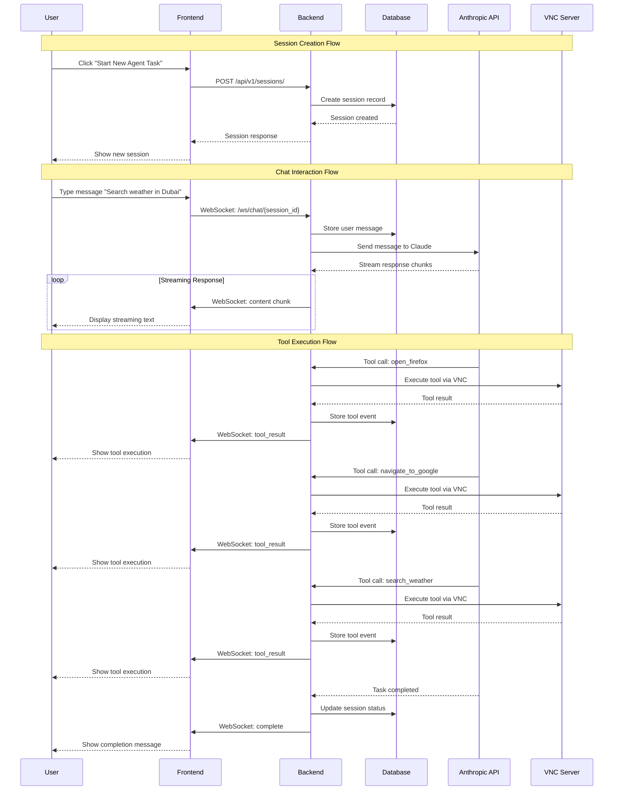

# System Sequence Diagram

## Session Creation and Computer Use Agent Interaction Flow



## Key Components Interaction

### 1. Session Management
- User creates new session via REST API
- Backend stores session metadata in PostgreSQL
- Frontend displays session in sidebar

### 2. Real-time Communication
- WebSocket connection established for each session
- Bidirectional communication for chat and progress updates
- Streaming responses from Anthropic API

### 3. Tool Execution
- Anthropic API determines required tools
- Backend executes tools via VNC connection
- Results stored in database and streamed to frontend

### 4. Progress Tracking
- Each tool execution tracked as event
- Real-time updates via WebSocket
- Complete history stored in database

## Data Flow

```
User Input → Frontend → WebSocket → Backend → Anthropic API
                                 ↓
                            Tool Execution
                                 ↓
                            VNC Server
                                 ↓
                            Tool Results
                                 ↓
                            Database Storage
                                 ↓
                            WebSocket Streaming
                                 ↓
                            Frontend Display
```

## Error Handling

- Database connection failures
- WebSocket disconnections
- Tool execution errors
- API rate limiting
- VNC connection issues

Each error type has appropriate fallback behavior and user notification.
